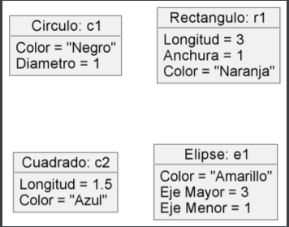
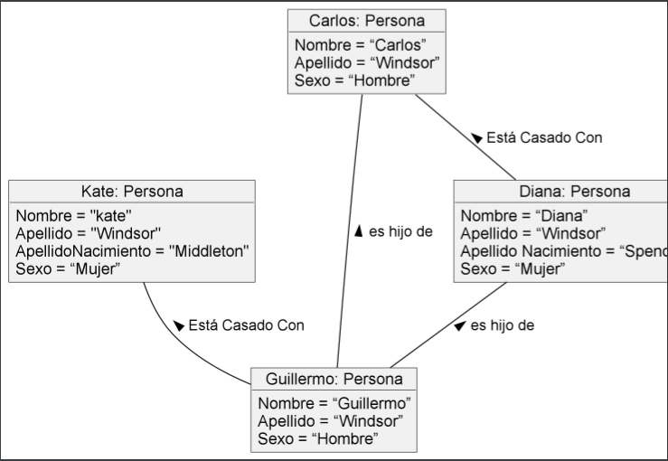
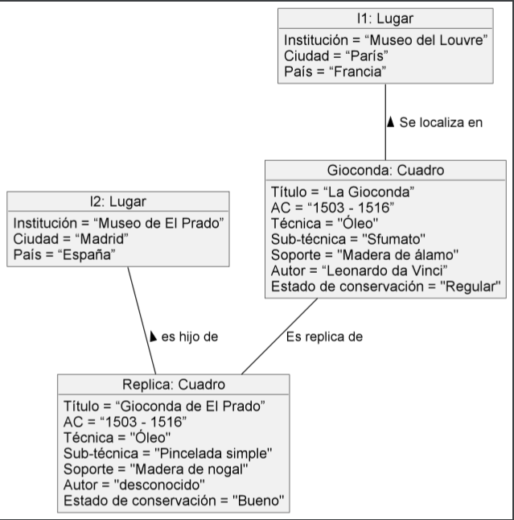
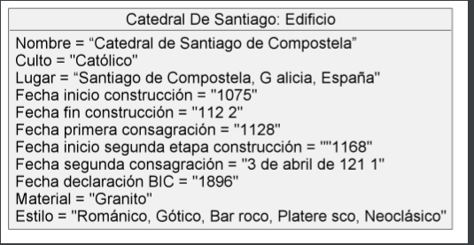
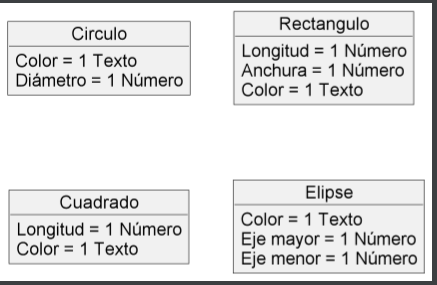
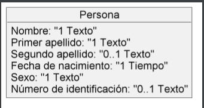
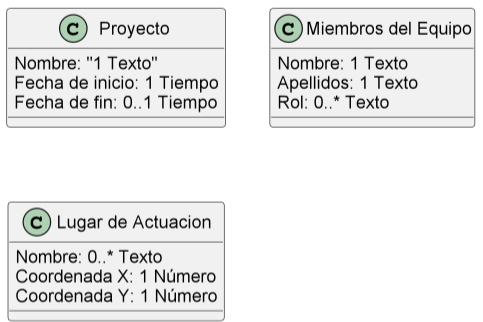

# UMLs

https://github.com/ElenaMegia/UMLs.git

**__Ejercicio 1__**

**__Ejercicio 2__**

**__Ejercicio 3__** 

**__Ejercicio 4__** 

**__Ejercicio 5__** 

**__Ejercicio 6__**

**__Ejercicio 7__**

**__Ejercicio 8__**

**__Ejercicio 9__**

**__Ejercicio 10__**

**__Ejercicio 11__**

